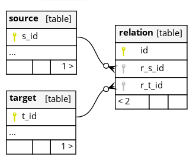

# Relation plugin

The plugin shall handle an multi-multi relationship between two tables/layers in a mor ergonomic way than the built-in QGIS relation widget.

It is based on a relation between 2 tables via an intermediate Pivot table:

## Installation

# Use
